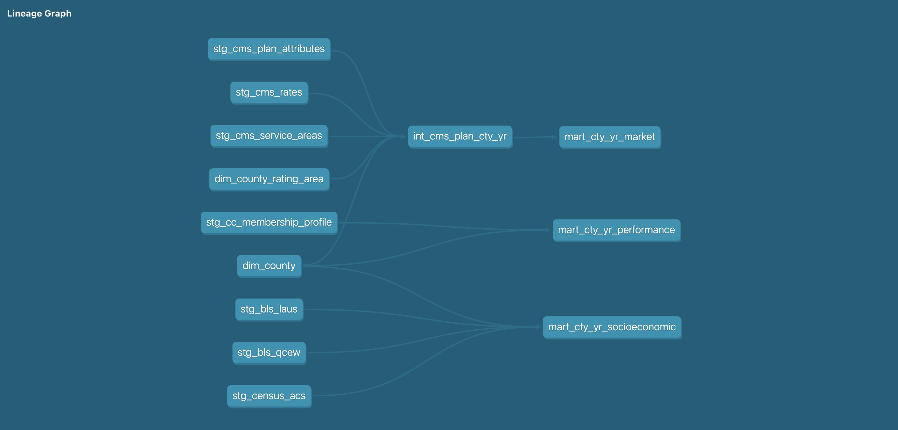

<p align="center">
  
</p>

<p align="center">
  
  
  
  
  
  
  
  
  
</p>

## Overview

[PROJECT OVERVIEW — TO BE WRITTEN]

This project analyzes California's individual ACA Marketplace at the county-year level using public data from CMS, Covered California, the U.S. Census Bureau, and the U.S. Bureau of Labor Statistics.

The analytical data pipeline is implemented with DuckDB and dbt. Source-specific staging models feed a plan-county intermediate model and three county-year analytical marts covering Marketplace conditions, Kaiser Permanente performance, and socioeconomic characteristics.

## Research Questions

- What socioeconomic and market characteristics across geographies are associated with Marketplace performance?
- Which areas currently exhibit these characteristics and outcomes?
- How are these socioeconomic and market characteristics expected to change over the next five to ten years?
- What considerations for future market analysis emerge from these findings?

## Project Scope

- **Geography:** California counties
- **Primary analytical grain:** county × year
- **Market:** ACA Individual Marketplace
- **Organization of interest:** Kaiser Permanente
- **Market data:** CMS California State-Based Exchange QHP Public Use Files
- **Performance data:** Covered California Active Member Profiles
- **Socioeconomic data:** Census ACS and BLS LAUS/QCEW
- **Historical analysis:** annual county-level observations
- **Forecasting horizon:** five to ten years

[ADDITIONAL SCOPE / FRAMING — TO BE WRITTEN]

## Data Sources

| Source | Dataset / File | Measures Used |
|---|---|---|
| CMS | [California SBE QHP PUF — Service Area](https://www.cms.gov/marketplace/resources/data/state-based-public-use-files) | Issuer service areas, counties served, market coverage |
| CMS | [California SBE QHP PUF — Plan Attributes](https://www.cms.gov/marketplace/resources/data/state-based-public-use-files) | Issuers, plans, metal levels, plan types, service areas, network IDs |
| CMS | [California SBE QHP PUF — Rates](https://www.cms.gov/marketplace/resources/data/state-based-public-use-files) | Rating areas and standardized individual premiums |
| Covered California | [Active Member Profiles](https://hbex.coveredca.com/data-research/active-member-profiles/) | Issuer enrollment by county, total Marketplace enrollment, Kaiser Permanente enrollment and market share |
| U.S. Census Bureau | [ACS B01003 — Total Population](https://data.census.gov/table?q=B01003:+TOTAL+POPULATION) | County population |
| U.S. Census Bureau | [ACS B19013 — Median Household Income](https://data.census.gov/table/ACSDT5Y2024.B19013) | Median household income |
| U.S. Census Bureau | [ACS S1701 — Poverty Status](https://data.census.gov/table?q=S1701:+POVERTY+STATUS+IN+THE+PAST+12+MONTHS) | Poverty rate |
| U.S. Census Bureau | [ACS S2701 — Health Insurance Coverage](https://data.census.gov/table?q=S2701:+HEALTH+INSURANCE+COVERAGE+STATUS) | Uninsured rate |
| BLS | [Local Area Unemployment Statistics (LAUS)](https://www.bls.gov/lau/tables.htm) | Labor force, employment, unemployment, unemployment rate |
| BLS | [Quarterly Census of Employment and Wages (QCEW)](https://www.bls.gov/cew/downloadable-data-files.htm) | Establishments, employment, average annual pay, annual changes |

Raw public-use files are not committed to the repository.

## Architecture
<p align="center">
  
</p>

The project uses a local DuckDB database as the analytical warehouse and dbt for SQL transformations, testing, lineage, and documentation.

## Data Model

### Staging

Staging models clean and standardize individual source datasets while retaining their source-level grain.

| Model | Source | Purpose |
|---|---|---|
| `stg_cms_service_areas` | CMS Service Area PUF | Standardized issuer service-area and county records |
| `stg_cms_plan_attributes` | CMS Plan Attributes PUF | Standardized Individual Marketplace plan attributes |
| `stg_cms_rates` | CMS Rate PUF | Standardized plan/rating-area premium records |
| `stg_cc_membership_profile` | Covered California | Standardized county × issuer enrollment records |
| `stg_census_acs` | Census ACS | Standardized county socioeconomic measures |
| `stg_bls_laus` | BLS LAUS | Standardized county labor-force measures |
| `stg_bls_qcew` | BLS QCEW | Standardized county employment and establishment measures |

### Reference Seeds

| Seed | Purpose |
|---|---|
| `dim_county` | Canonical California county names, state identifiers, and five-digit county FIPS codes |
| `dim_county_rating_area` | Mapping between California counties and ACA geographic rating areas |

Los Angeles County is not assigned a single rating area in `dim_county_rating_area` because it spans two ACA rating areas. County-level premium metrics for Los Angeles are therefore left null.

### Intermediate

#### `int_cms_plan_county_year`

**Grain:** one row per plan × county × year.

This model:

- joins CMS Plan Attributes and Service Area data;
- standardizes county geography through `dim_county`;
- maps counties to ACA rating areas;
- attaches the standardized age-40 individual premium from the CMS Rate PUF;
- identifies Kaiser Permanente plans;
- retains Individual, non-dental, on-exchange plans.

For premium comparisons, the model uses:

- age `40`;
- tobacco value `No Preference`;
- `individual_rate`;
- the earliest available rate period within each plan × rating area × year.

CMS Rate PUF `plan_id` values are matched to Plan Attributes `standard_component_id`.

### Analytical Marts

#### `mart_cty_yr_market`

**Grain:** one row per county × year.

Includes:

- carrier count;
- plan count;
- Silver plan count;
- Gold plan count;
- lowest-cost Silver premium;
- benchmark Silver premium;
- carrier entries;
- carrier exits;
- Kaiser Permanente availability;
- Kaiser Permanente plan count.

Plan availability counts use distinct `standard_component_id` values rather than cost-sharing variant-level plan IDs.

#### `mart_cty_yr_performance`

**Grain:** one row per county × year.

Includes:

- Kaiser Permanente enrollment;
- total Marketplace enrollment;
- Kaiser Permanente market share;
- year-over-year Kaiser Permanente enrollment growth;
- year-over-year total Marketplace enrollment growth;
- year-over-year change in Kaiser Permanente market share.

#### `mart_cty_yr_socioeconomic`

**Grain:** one row per county × year.

Includes:

- total population;
- year-over-year population growth;
- median household income;
- poverty rate;
- uninsured rate;
- labor force;
- employment and unemployment;
- unemployment rate;
- establishment count;
- QCEW employment;
- average annual pay;
- year-over-year establishment, employment, and pay changes.

## Methodology

### Data Engineering

Raw files are loaded into DuckDB through dbt staging models. Transformations follow three layers:

1. **Staging** — source cleaning, column standardization, type casting, and basic normalization.
2. **Intermediate** — reusable grain-changing and cross-source business logic.
3. **Marts** — final county-year analytical tables used for analysis and modeling.

County FIPS codes are used as the primary geographic join key. Canonical county attributes are supplied through the `dim_county` seed.

dbt tests are used to validate expected analytical grains and required identifiers.

### Exploratory and Statistical Analysis

[TO BE WRITTEN]

### Forecasting / Machine Learning

[TO BE WRITTEN]

### Visualization

[TO BE WRITTEN]

## Repository Structure

```text
kp-marketplace-analysis/
│
├── README.md
├── .gitignore
├── requirements.txt
│
├── data/
│   ├── raw/                         # gitignored source files
│   ├── processed/                   # gitignored DuckDB database / generated data
│
├── dbt/
│   ├── dbt_project.yml
│   ├── models/
│   │   ├── staging/
│   │   │   ├── covered_ca/
│   │   │   ├── census/
│   │   │   ├── bls/
│   │   │   └── cms/
│   │   │
│   │   ├── intermediate/
│   │   │   └── int_cms_plan_county_year.sql
│   │   │
│   │   └── marts/
│   │       ├── mart_cty_yr_market.sql
│   │       ├── mart_cty_yr_performance.sql
│   │       └── mart_cty_yr_socioeconomic.sql
│   │
│   ├── seeds/
│   │   ├── dim_county.csv
│   │   └── dim_county_rating_area.csv
│   │
│   └── tests/
│
│
├── notebooks/
│   ├── 01_eda.ipynb
│   ├── 02_relationship_analysis.ipynb
│   └── 03_forecasting.ipynb
│
├── src/
│   └── modeling/
│
├── outputs/
│   ├── figures/
│   └── tables/
│
├── reports/
│
└── docs/
    ├── assets/
        └── banner.png
```

## Setup

### 1. Clone the repository

```bash
git clone <REPOSITORY_URL>
cd kp-marketplace-analysis
```

### 2. Create and activate a virtual environment

```bash
python3.14 -m venv .venv
source .venv/bin/activate
```

### 3. Install dependencies

```bash
pip install -r requirements.txt
```

### 4. Download source data

Raw source files are excluded from version control.

### 5. Configure dbt

The dbt project uses the `kp_analysis` profile and a DuckDB database.

Example profile:

```yaml
kp_analysis:
  outputs:
    dev:
      type: duckdb
      path: data/processed/analysis.duckdb
      threads: 4
  target: dev
```

The exact database path should correspond to the working-directory convention used when running dbt.

### 6. Install dbt packages

```bash
dbt deps
```

### 7. Load reference seeds

```bash
dbt seed --full-refresh
```

### 8. Build and test the warehouse

```bash
dbt build
```

The final analytical models are:

```text
mart_cty_yr_market
mart_cty_yr_performance
mart_cty_yr_socioeconomic
```

## Results

[RESULTS — TO BE WRITTEN AFTER ANALYSIS]

## Limitations

Documented data/modeling constraints include:

- Los Angeles County spans multiple ACA rating areas, so a single county-level premium is not assigned.
- CMS source schemas and field completeness vary across file vintages.
- CMS Rate PUF `qhp_non_qhp_type_id` is not consistently populated across years; on-exchange status is therefore established through the filtered Plan Attributes records rather than requiring the corresponding Rate PUF field.
- Premium measures use a standardized age-40 individual rate with tobacco status reported as `No Preference`.
- Where multiple rate periods exist within a plan year, the earliest available rate period is used.
- Socioeconomic source availability varies by year, so coverage of the socioeconomic mart is determined by available source-year combinations.

[ADDITIONAL ANALYTICAL / FORECASTING LIMITATIONS — TO BE WRITTEN]

## Future Work

[TO BE WRITTEN]

## Disclaimer

This is an SFSU BUS 895 student capstone prepared for a Kaiser Permanente client. Findings are for academic discussion. They do not represent Kaiser Permanente.